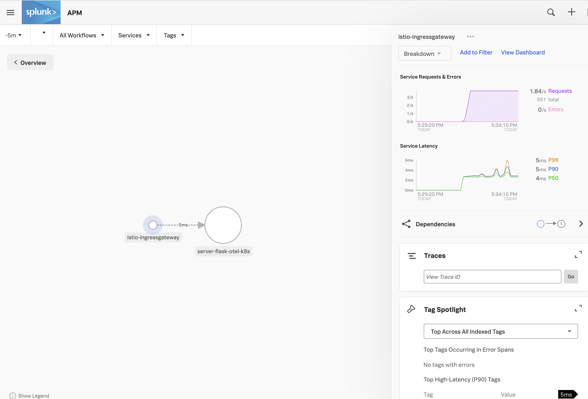
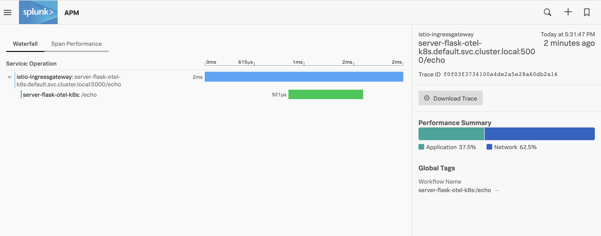

## Istio Setup

NOTES:

THIS LAB IS DESIGNED FOR THE UBUNTU SANDBOX CREATED AT THE START OF THE APM WORKSHOP AND IS TESTED IN THAT ENVIRONMENT ONLY  

THIS LAB IS A WORK IN PROCESS AND YOUR RESULTS MAY VARY  

This exercise will install an Istio service mesh on a kubernetes cluster that directs external requests to a Python Slask server.

Both the service mesh and the Flask server will emit spans.

The result will show tracing of the request through the mesh to the Flask server.

### Step 1: Install OpenTelemetry Collector  

If you have an existing collector running remove it.

<!-- Install Splunk Otel Collector in its own namespace:  
`kubectl create namespace splunk-otel-collector` -->

Follow Data Setup wizard but add:  
<!-- `--namespace splunk-otel-collector`    -->
`--set autodetect.istio=true`

i.e.

```
helm install \
--set splunkAccessToken='YOURTOKENHERE' \
--set clusterName='YOURCLUSTERNAMEHERE' \
--set provider=' ' \
--set distro=' ' \
--set splunkRealm='YOURREALMHERE' \
--set otelCollector.enabled='true' \
--namespace splunk-otel-collector \
--set autodetect.istio=true \
--generate-name \
splunk-otel-collector-chart/splunk-otel-collector
```

### Step 2: Set Up Istio 

Set up Istio:

`curl -L https://istio.io/downloadIstio | sh -` 

`./istio-VERSIONHERE/bin/istioctl install`

To install the Splunk tracing profile for Istio:  

Change to the Istio install directory:  
`./istio-VERSIONHERE/bin/istioctl install -f ~/apmworkshop/apm/k8s/istio/tracing.yaml`

### Step 3: Deploy Istio configurations and example Flask microservice   

Set and validate ingress ports for Nodeport example and configure ingress host for local k3s workshop example:  
`source setup-envs.sh`  

You should see a result that looks like:  
```
TCP_INGRESS_PORT=
INGRESS_PORT=30785
INGRESS_HOST=172.31.19.248
SECURE_INGRESS_PORT=32071
```

Deploy Flask service configured for Istio:  
`kubectl apply -f flask-deployment-istio.yaml`  

Single test Flask service:  
`source test-flask.sh`  

Results should show a direct request to the Flask server:  

```
You getted: b'' Request headers: Host: localhost:30001
User-Agent: curl/7.68.0
Accept: */*
Server: 1
```

Single test Istio:  
`source test-istio.sh`  

When hitting the service mesh from outside the cluster, you'll receive the mesh diagnostic data plus the B3 Trace/Span ID:

```
You getted: b'' Request headers: Host: 172.31.19.248:31177
User-Agent: curl/7.68.0
Accept: */*
Server: 1
X-Forwarded-For: 10.42.0.1
X-Forwarded-Proto: http
X-Envoy-Internal: true
X-Request-Id: 447af547-7b8f-96db-a0b5-08efce526a8d
X-Envoy-Decorator-Operation: server-flask-otel-k8s.default.svc.cluster.local:5000/echo
X-Envoy-Peer-Metadata: ChQKDkFQUF9DT05UQUlORVJTEgIaAAoaCgpDTFVTVEVSX0lEEgwaCkt...
3NnYXRld2F5
X-Envoy-Peer-Metadata-Id: router~10.42.0.11~istio-ingressgateway-7d97f78f5-dg5zc.istio-system~istio-system.svc.cluster.local
X-Envoy-Attempt-Count: 1
X-B3-Traceid: 5035304e854aa834e990df295b1d98e9
X-B3-Spanid: e990df295b1d98e9
X-B3-Sampled: 1
```

To generate many requests so that the example appears in the APM service map, use the load generator:  

Load gen Istio for two minutes:    
`source loadgen.sh`  

You will see a service map with the Istio mesh and the Flask server:  

  

Traces will show the service mesh trace and the service itself:  

  

Stop loadgen:  
`ctrl-c`  

Cleanup:  
remove k8s examples:  
`source delete-all.sh`

Remove Istio:  
From the Istio bin directory: 
`istioctl x uninstall --purge`
