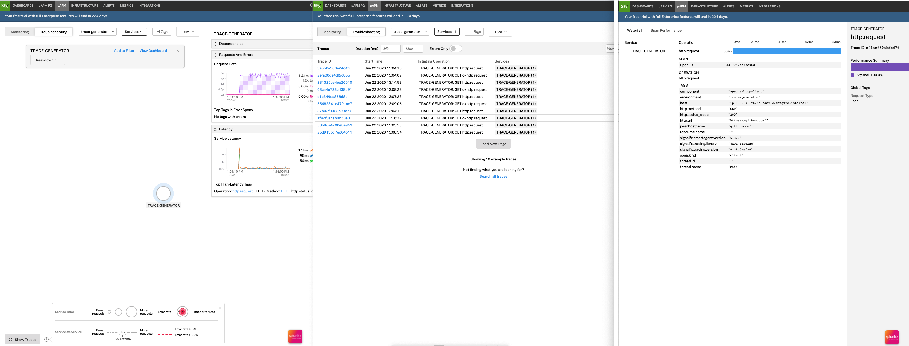

# Splunk APM Trace Generator Demo For AWS ECS Fargate

This repo demonstrates a reference implemenation for a single AWS ECS Fargate task example of Splunk APM.

The single task spins up two ECS Fargate containers:

#1 Splk-Agent - sidecar to observe ECS and relay traces to SignalFx   
#2 Trace-Generator-Fargate - generates traces using Python Requests doing GET requests to https://api.github.com

### SETUP
The agent is a standard deployment of a Fargate container as documented here: [Splunk Infra Fargate Deployment](https://github.com/signalfx/signalfx-agent/tree/master/deployments/fargate)

The Splunk Infraagent.yaml file is based on this [Fargate Example agent.yaml](https://raw.githubusercontent.com/signalfx/apmworkshop/master/apm/agent/fargate/agent.yaml)

It has been configured for APM with instructions here:
https://docs.signalfx.com/en/latest/apm/apm-getting-started/apm-smart-agent.html

The result is this file here- to use this you must change the REALM of the trace endpoint url (or set it as an environment variable) in the `.json` task definition: [Fargate Example agent.yaml](https://raw.githubusercontent.com/signalfx/apmworkshop/master/apm/agent/fargate/agent.yaml)

To deploy this example, you must have a Fargate ECS environment ready to go with VPC, task roles for logs, etc..

Everything to test this example follows the ECS tutorial documentation here:
https://docs.aws.amazon.com/AmazonECS/latest/developerguide/ECS_AWSCLI_Fargate.html

Pay critical attention to setting up VPC in advance:
https://docs.aws.amazon.com/AmazonECS/latest/developerguide/task_definitions.html

And log environment tutorial here:
https://docs.aws.amazon.com/AmazonECS/latest/developerguide/using_cloudwatch_logs.html

Once all of the above is done:

### STEP 1
Deploy with the following commands- *you must change the variables in caps in `trace-generator.json` to suit your environment:*

RELEASEVERSIONHERE: Use the current SignalFx SmartAgent version in the Helm script below from here: https://github.com/signalfx/signalfx-agent/releases i.e. 5.5.5

```
aws ecs create-cluster --cluster-name test-cluster  
aws ecs register-task-definition --cli-input-json file://trace-generator.json
```
### STEP 2
Create the service based on the task just registered.

Note that the task definition will increment each time you try it- from 1 to 2 etc... 
To check which version is current use:

`aws ecs list-task-definitions`

To create the service:  

`aws ecs create-service --cluster test-cluster --service-name splk-demo --task-definition splk-demo:1 \`    
`--desired-count 1 --launch-type "FARGATE" \`    
`--network-configuration "awsvpcConfiguration={subnets=[subnet-YOURSUBNETIHERE],securityGroups=[sg-YOURSECURITYGROUPIDHERE],assignPublicIp=ENABLED}"`    

### STEP 3

#### Note that this demo does not generate RED metrics- only traces! 

Click "Troubleshoot" in your APM console, make sure you are in the `trace-generator environment` by clicking on the pulldown menu next to "Troubleshoot", and click "Show Traces" from lower left of screen to see traces. 

See below left of furthest left screen for this link.

The framework used to generate requests is Python Requests.

The screenshot below shows what the traces will look like.

  

### How it works

The key to this working is that the trace generator container is sending its traces to ```localhost``` which is network addresss shared with the agent container. The agent running in the agent container sees these traces and has been configured to send them to SignalFx.

The trace generator is using the automatic instrumentation for tracing from SignalFx and uses the Python Request libraries to request a neutral external website (set up in the Java code) once and then wait a random time between one and two seconds.

If you just want to run the SmartAgent, you can use the `fargate-agent.json` example.

### Extras

The [commands.md](./commands.md) file offers helpful commands for ECS Fargate management for the AWS CLI.

Dockerfile for the java trace generator is here: https://raw.githubusercontent.com/signalfx/apmworkshop/master/apm/python/dockerfile-sfx-python
