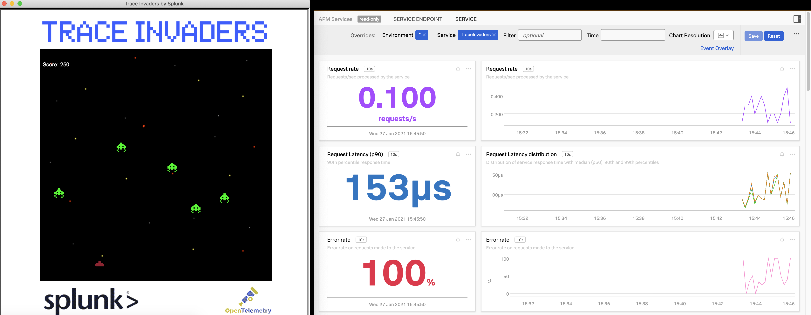

# Python Trace Invaders by Splunk and OpenTelemetry



## Defeat the aliens who are sending error spans by shooting them- each successful shot sends a healthy request!
## With sound!

This game showcases [OpenTelemetry Manual Python Instrumentation](https://opentelemetry-python.readthedocs.io/en/stable/)

TraceInvaders runs on MacOS w/ sound effects and Windows w/o sound effects. On Windows you'll need to manually set the environment variables that `setup.sh` creates

A Splunk APM account is required but the Splunk APM or Infrastructure agent is not.

### Step #1

Make sure you have python3 set up on your Mac and its path is correct such that `python3` command works.  

Set up your Mac for Splunk Python OpenTelemetry:

Make sure you don't have conflicting Python OpenTelemetry or APM packages- this command cleans out all PIP packages: `pip freeze | xargs pip uninstall -y`

```
python3 -m pip install --upgrade pip && \
python3 -m pip install wheel && \
python3 -m pip install splunk-opentelemetry[all] && \
export PATH="$HOME/.local/bin:$PATH" && \
splk-py-trace-bootstrap
```

### Step #2

Set up your Splunk APM REALM and TOKEN by editing: `setup.sh` and then run the setup script: `source setup.sh`

### Step #3 Run Game

To run game: `source startgame.sh`

Note- the game will still run if not connected to Splunk APM.

### Instructions ###

**Instructions**

The Splunk APM Service Dashboard for TraceInvaders shows a req/sec every time you hit an alien.

Every time the aliens advance downwards towards you, an error span is generated.
The goal is to keep the reqs/sec high and the error spans at zero.

Exit by closing game window or ctrl-c in terminal.

**Troubleshooting**

If you see this in your terminal during gameplay `ConnectionRefusedError: [Errno 61] Connection refused` then recheck your Splunk Realm and Token in the `setup.sh` script and re-run it.


Open source heritage:
This is a project written originally by Christian Thompson (http://christianthompson.com/node/45) in Python 2. And was rewritten in Python 3 here: https://github.com/samkoe/space_invaders and further modified by Splunk for OpenTelemetry and branding.
