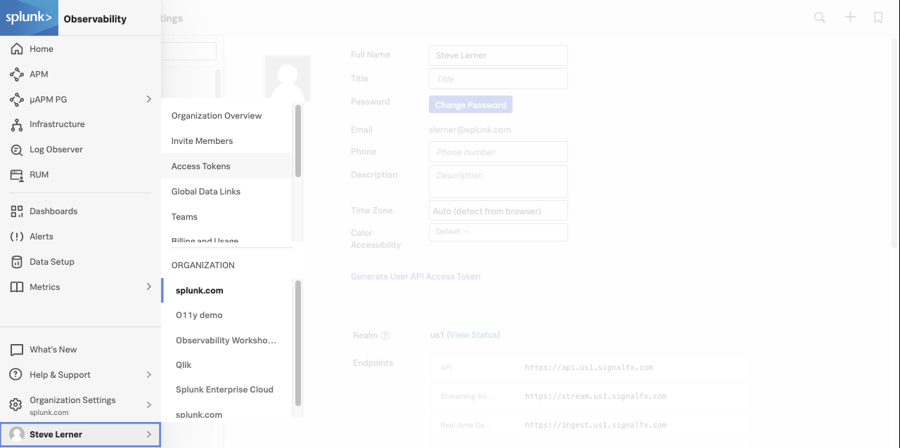

## APM Preparation

---

### Prep Step 1: Log in to your Splunk Observability account to identify token/realm  

Check your [Splunk Observability Account](https://app.us1.signalfx.com/o11y/#/home) (your welcome email has this link) and identify your TOKEN and REALM- these are available in the profile menu in your Splunk Observability account. Note that the realm component i.e. `us1` may be different for your account based on how you signed up.

How to find realm:

`Splunk Observability Menu -> Your Name -> Account Settings`    

  

How to find token:  
  

---

### Prep Step 2: Choose/ Create Lab Environment  

Splunk Observability is for **server environments**.    

This workshop uses **Ubuntu Linux** as the server environment.    
You can use any Ubuntu platform- bare metal, VM, or cloud VM.

You can choose an existing Ubuntu machine that you have or create or you can follow our guide below to make an Ubuntu VM on your Mac / Windows PC.  
If you chose your own Ubuntu machine, you can set it up with the Workshop software with this command: 

`bash <(curl -s https://raw.githubusercontent.com/signalfx/apmworkshop/master/setup-tools/ubuntu.sh)`

#### Guide: Create an Ubuntu Linux environment on a Mac or PC and install the necessary software components:

#### <ins>Mac</ins>

**#1 Install Brew**  

Install [brew package manager](https://brew.sh):  
`/bin/bash -c "$(curl -fsSL https://raw.githubusercontent.com/Homebrew/install/HEAD/install.sh)"` 

Make sure `brew` is fully upgraded: `brew upgrade`

Results should be at least 1.5:
```
$ brew --version
Homebrew 2.6.0
```

**#2 Install Multipass**

We will use [Multipass](https://multipass.run) as a hypervisor for Mac: 

Install Multipass: `brew cask install multipass`

If needed, further instructions are here: https://multipass.run/docs/installing-on-macos

Do one final brew upgrade before spinning up VM: `brew upgrade`

#### <ins>Windows</ins>  

Follow Multipass Windows installation instructions: https://multipass.run/docs/installing-on-windows

**#3 Launch Multipass Ubuntu VM**

Create your VM called "primary":  
`multipass launch -n primary -d 10G -m 8G`

This will download Ubuntu and may take a few minutes the first time.

Basic multipass commands:  
Shell into VM: `multipass shell primary`  
Exit VM: `exit`

To manage multipass VM:  
`multipass stop primary` stops the VM  
`multipass delete primary` deletes the VM from the hypervisor  
`multipass purge` purges created images but leaves the ubuntu template intace  

**#4 Install Lab Software On Ubuntu VM**

A bootstrap script will install everything needed and clone this repo.  
This will take up to 10 minutes to execute- leave it running until complete.  

`multipass shell primary`  

Once in your Multipass Ubuntu VM:

`bash <(curl -s https://raw.githubusercontent.com/signalfx/apmworkshop/master/setup-tools/ubuntu.sh)`

---

### Prep Step 3: Review KEY SPLUNK APM CONCEPTS

1. There are two moving parts to OpenTelemetry APM:   
 
   **Application Spans:**  
   OpenTelemetry instrumentation causes spans to be emitted by your applications. OpenTelmetry auto-instrumentation (no code changes) for most languages is availabile but you can use any framework/library that emits spans in formats zipkin, OpenTracing, or [OpenTelemetry](https://opentelemtry.io). The spans are received by an OpenTelemetry Collector which both doubles as an infrastructure metrics collection agent and a telemetry processor. The Collector then forwards all telemetry (metrics/traces/logs) to Splunk Observability Cloud.  
    
   **Instructructure metrics:**  
   Infrastructure metrics are collected by your OpenTelemetry Collector which is observing the application's host or container cluster. The infrastructure agent is lightweight, open source, real-time, and designed for microservices, containers, and cloud.  

2. Application spans will be sent to the OpenTelemetry Collector running on a host or k8s pod to correlate APM with host metrics. The Collector then relays the spans to Splunk Observability Cloud APM where they will be assembled into traces.  

3. The APM spans flow in real time and there is no sampling. Pre-made default Service Dashboards with application metrics for each app will appear once spans are received by Splunk APM. The APM view has directed troubleshooting.  

4. Environment variables: control the setup of APM. These names vary based on instrumentation but they always include two:  
**Endpoint**: destination to send spans  
**Service name**: the name of the application as you want it to appear in a service map  
**Environment**: a value for segmenting betwen dev/prod etc. Can be set with instrumentation and not necessarily as part of an ENV variable.

[Return to workshop for next step](../README.md)
